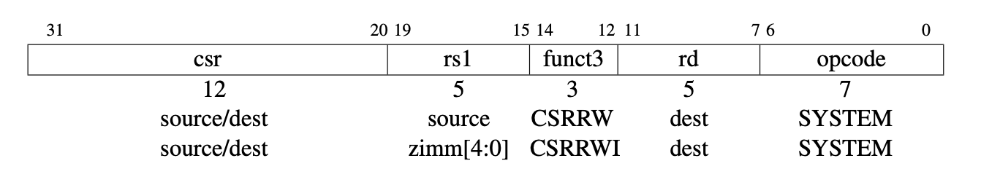

# EECS 151/251A ASIC Project Specification: Checkpoint 2
<p align="center">
Prof. John Wawrzynek
</p>
<p align="center">
TA: Kevin He, Kevin Anderson
</p>
<p align="center">
Department of Electrical Engineering and Computer Science
</p>
<p align="center">
College of Engineering, University of California, Berkeley
</p>

---
## Checkpoint 2: Fully functioning core
Your job is to implement a 3-stage RISC-V CPU.
Besides implementing the base RISC-V instruction set,
there are a few other required features, as described below.

#### 1 Control and Status Register (CSR)
The test harness requires your processor to support a few new instructions.
Read through Chapter 9 in the RISC-V specification. A CSR (or
control status register) is some state that is stored independent of the register file and the memory.
While there are 2^12 possible CSR addresses, you will only use one of them (`tohost = 0x51E`). The
`tohost` register is monitored by the test harness, and simulation ends when a value is written to this
register. A value of 1 indicates success, a value greater than 1 gives clues as to the location of the failure.
There are 2 CSR related instructions that you will need to implement:
1. `csrw tohost,t2` (short for `csrrw x0,csr,rs1` where `csr = 0x51E`)
2. `csrwi tohost,1` (short for `csrrwi x0,csr,zimm` where `csr = 0x51E`)

`csrw` will write the value from register in rs1. `csrwi` will write the
immediate (stored in the same bit field as rs1) to the addressed csr. Note that you
do not need to write to rd (writing to x0 does nothing).

<p align="center">

</p>

### 2. Details

#### 2.1 Reset
Your CPU will have an input reset signal that the testbench toggles. Once out of reset, 
your CPU should start at PC address `0x2000` (defined as `PC_RESET` in `src/const.vh`)
and begin executing instructions. You may change this reset address to match your design.

#### 2.2 Misaligned Addresses
According to the RISC-V ISA spec, reads and writes to memory addresses not aligned to a 32-bit word boundary (or 16-bit for halfword) should cause an exception. In this project, for the purpose of simplicity, we ignore the misaligned bits (i.e. set them to zero), which is done in `Memory151.v` by only using address bits `31:2`. 

### 3. File Structure
Implement the datapath and control logic for your RISC-V processor in the file `Riscv151.v`. Make
sure that the inputs and outputs ports declaration remain the same, since this module connects to the memory system
for system-level testing. If you look at `riscv_test_harness.v` you can see a testbench that
is provided. Target this testbench in your `sim-rtl.yml` file by changing the `tb_name` key to
`rocketTestHarness`.

### 4. Running the Test
This testbench will load a program into the instruction memory, and will then run until the exit code
register has been set. 
There is also a timeout to make sure that the simulation does not run forever. 
You should only be running this test
suite after you have eliminated some of the bugs using single instruction tests, as described below.

### 5. Assembly tests
We have provided a suite of assembly tests to help you debug the instructions you need to support.
To run all of them:
```
make sim-rtl test_asm=all
```
This will generate .out files in the `asm_output/` directory, and summarize which tests passed and
failed. You can also run a single asm test with the following command:
```
make sim-rtl test_asm=simple.out
```
If you would like to generate waveforms for a single test:
```
make sim-rtl test_asm=simple.vpd
```
`simple` may be replaced with any of the available tests defined in the `Makefile`.

You can read the assembly code being tested by looking at the dump file.
Comments in the code will help you understand what is happening.
```
cd tests/asm/
vim addi.dump
```
Last, you can see the hex code that is loaded directly into the memory by looking at the hex file.
```
cd tests/asm/
vim addi.hex
```

To debug these tests, use DVE. The VPD files will be saved to `asm_output/`.

### 6. Benchmark tests
Once you pass the assembly tests, you should also be able to pass the benchmark tests.
This test suite includes many C programs that do
various things to test your processor. You can observe the number of cycles
that each benchmark test takes to run by opening `bmark_output/*.out` and taking note of the number
at the end of the report. The `make sim-rtl test_bmark=all` target will also print this number for you.
To run a specific benchmark (e.g., cachetest), run
```
make sim-rtl test_bmark=cachetest.out
```

Note that if you type the name of the test incorrectly, the test will not print
a cycle-by-cycle log, and will fail after 1001 cycles.
You may need to increase the timeout for some of the longer tests (like sum,
replace and cachetest) to pass. Timeouts are configured in the `Makefile`.


### 7. Checkpoint 2 Deliverables
*Checkoff due: 6PM  4/11/24 (Kevin A's OH)*
Please answer the following questions to be checked off by a TA.

1. Show that all of the assembly tests pass

2. Show your final pipeline diagram, updated to match the code.

3. Push your implementation and updated pipeline diagram to your repo.
